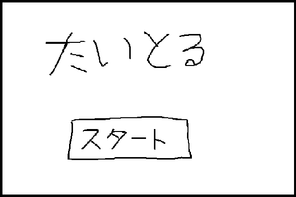

# pptp_game

ポプテピピックのゲームをつくります
JavaScriptのお勉強～

## どんなゲームか
ポプテピピックの第2話の「うえーどうぶつえん」をゲーム化

出てきたどうぶつに対してまだ見てないなら「かわいい！」、見たことあるなら「もう見た」を選んでいくゲーム

## 仕様
### 画面シーン
* 画面サイズ
    * width 1000px
    * hight 675px
* タイトル
* ゲーム
* リザルト

### タイトル

### ゲーム
パンダたのしみー！

* もうみたかもう見てないかを判定していく

### ゲームオーバー条件
* 一度見ているのに「かわいい！」
* まだ見ていないのに「もう見た」

スコア計算
* 内部にタイマー(10秒)をもっておく
* 1回のスコア = 基本点 × ラウンド数 × タイマーの残り時間
    * つまり時間かけると0点になるってこと